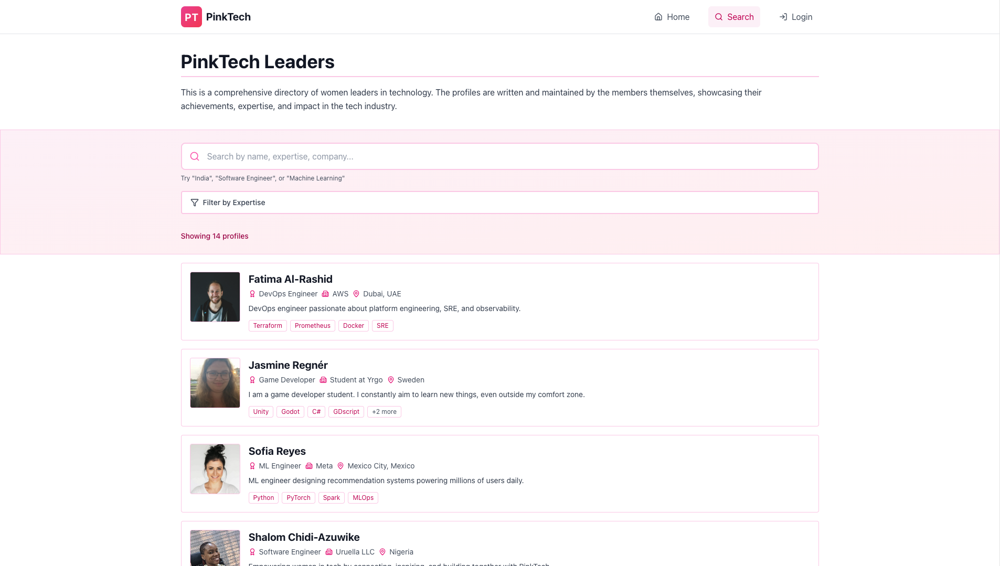
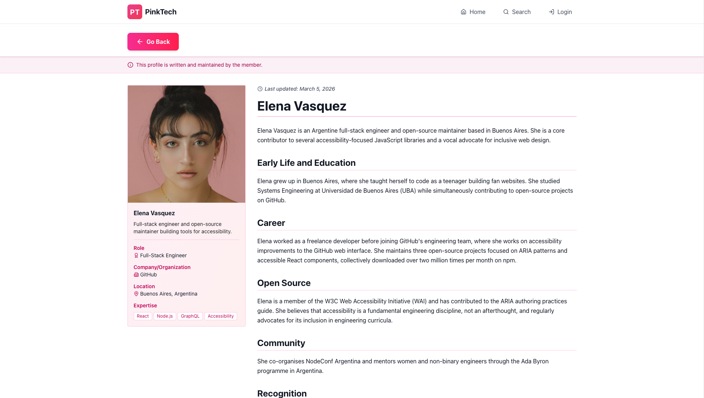
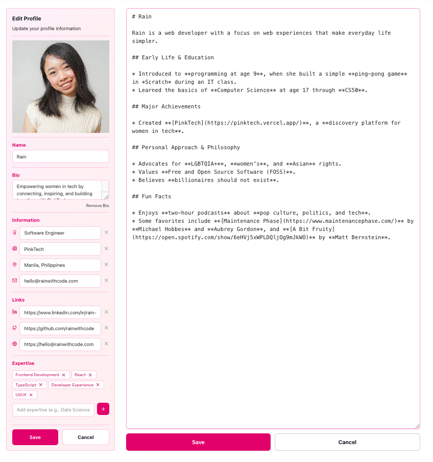

# PinkTech

**Discover women shaping today's technology.**

PinkTech is the definitive directory of inspiring leaders, innovators, and experts across the tech industry. Create your public profile, get discovered by peers and employers, and explore the women driving today's technology.

## Features

### Home

Browse featured leaders and search the directory from the homepage.


### Search

Filter profiles by name, expertise, company, and more to find exactly who you're looking for.



### Profile

View a leader's full biography, expertise, and social links.



### My Profile

Create and edit your own public profile — control how you're represented in the directory.



## Tech Stack

| Layer      | Technology                         |
| ---------- | ---------------------------------- |
| Framework  | React 19 + TypeScript              |
| Build tool | Vite with SWC                      |
| Styling    | Tailwind CSS v4                    |
| Routing    | React Router v7                    |
| Backend    | Supabase (auth, database, storage) |
| Animations | Framer Motion                      |
| Icons      | Lucide React                       |

## Project Structure

```
pink-tech/
├── index.html                        # App entry point
├── vite.config.ts                    # Vite + SWC build config
├── vercel.json                       # Vercel deployment config (SPA rewrites)
├── supabase/
│   └── functions/
│       └── delete-account/           # Edge function — deletes the auth user and profile
└── src/
    ├── App.tsx                       # Root component: router + context providers
    ├── main.tsx                      # React DOM entry point
    ├── config/
    │   └── supabaseClient.ts         # Lazy Supabase client initialisation
    ├── types/
    │   └── UserProfile.ts            # Shared UserProfile TypeScript type
    ├── styles/
    │   └── index.css                 # Global styles + Tailwind directives
    ├── utils/
    │   ├── avatarStorage.ts          # Supabase Storage helpers for avatar upload
    │   ├── snakeCase.ts              # camelCase ↔ snake_case conversion utilities
    │   └── validators.ts             # Username and password validation rules
    ├── contexts/
    │   ├── AuthContext.tsx           # Auth state (session, cached user, login/logout)
    │   └── ProfilesContext.tsx       # Global profiles list with search + filter state
    ├── hooks/
    │   ├── useProfiles.ts            # Raw hook: fetches and filters profiles from Supabase
    │   └── useProfilesContext.ts     # Convenience hook to consume ProfilesContext
    ├── pages/
    │   ├── auth/
    │   │   ├── Login.tsx             # Sign-in page
    │   │   ├── SignUp.tsx            # Registration page
    │   │   └── Verify.tsx            # Post-signup email verification notice
    │   └── main/
    │       ├── Home.tsx              # Landing page (hero, featured profiles, search)
    │       ├── Search.tsx            # Full search page with filters and results
    │       ├── ProfileDetail.tsx     # Public profile view (editable by owner)
    │       └── Settings.tsx          # Account settings page (username, avatar, delete)
    ├── components/
    │   ├── auth/
    │   │   ├── ProtectedRoute.tsx    # Redirects unauthenticated users to /login
    │   │   ├── GuestRoute.tsx        # Redirects authenticated users away from auth pages
    │   │   ├── LoginForm.tsx         # Email + password sign-in form
    │   │   ├── SignUpForm.tsx        # Registration form with username availability check
    │   │   └── EmailVerificationNotice.tsx  # Banner shown after signup
    │   ├── layout/
    │   │   ├── Layout.tsx            # Shared page shell (header + main + footer)
    │   │   ├── Header.tsx            # Sticky top navigation bar
    │   │   ├── Footer.tsx            # Site footer
    │   │   ├── Hero.tsx              # Homepage hero section
    │   │   └── CallToAction.tsx      # Sign-up prompt section
    │   ├── navigation/
    │   │   ├── DesktopNavigationMenu.tsx   # Horizontal nav links (md+)
    │   │   ├── MobileNavigationMenu.tsx    # Fixed bottom nav bar (mobile)
    │   │   ├── HomeNavigation.tsx          # Logo / home link
    │   │   ├── BackNavigation.tsx          # Generic back button
    │   │   ├── AuthBackNavigation.tsx      # Back button for auth flows
    │   │   ├── ErrorBackNavigation.tsx     # Back button on error pages
    │   │   └── ScrollToTopButton.tsx       # Floating scroll-to-top button
    │   ├── profile/
    │   │   ├── detail/
    │   │   │   ├── ProfileCard.tsx          # Profile layout wrapper
    │   │   │   ├── ProfileInfobox.tsx       # Name, title, company display
    │   │   │   ├── ProfileInfoboxForm.tsx   # Inline edit form for infobox fields
    │   │   │   ├── ProfileContent.tsx       # Biography / long-form content display
    │   │   │   ├── ProfileContentForm.tsx   # Inline edit form for biography
    │   │   │   ├── ProfileImageEditor.tsx   # Avatar upload and crop UI
    │   │   │   ├── ProfileSocials.tsx       # Social media links display
    │   │   │   └── ProfileAuthorshipNotice.tsx  # "You own this profile" banner
    │   │   ├── home/
    │   │   │   ├── FeaturedProfiles.tsx     # Featured profiles grid on homepage
    │   │   │   └── FeaturedProfileCard.tsx  # Single card in the featured grid
    │   │   └── settings/
    │   │       ├── AccountSettings.tsx      # Username and account info editor
    │   │       └── DeleteAccount.tsx        # Account deletion confirmation flow
    │   └── ui/
    │       ├── LoadingState.tsx        # Full-page loading spinner
    │       ├── ErrorState.tsx          # Full-page error display
    │       ├── ErrorImage.tsx          # Decorative error illustration
    │       ├── Pagination.tsx          # Page number controls
    │       ├── ImageWithFallback.tsx   # Image with automatic placeholder fallback
    │       ├── UserPlaceholderIcon.tsx # SVG avatar placeholder
    │       ├── LazyIcon.tsx            # Lazily-loaded Lucide icon wrapper
    │       ├── PasswordStrengthBar.tsx # Visual password strength indicator
    │       ├── PasswordRequirements.tsx # Password rule checklist
    │       └── sonner.tsx              # Themed toast notification component
    └── features/
        └── search/
            ├── components/
            │   ├── HomeSearch.tsx        # Compact search bar used on the homepage
            │   ├── SearchHeader.tsx      # Search page heading and results summary
            │   ├── ProfileSearchBar.tsx  # Full search bar composition
            │   ├── SearchInput.tsx       # Controlled text input for search
            │   ├── ProfileList.tsx       # Paginated list of matching profiles
            │   ├── ProfileCard.tsx       # Search result profile card
            │   └── ProfilesCount.tsx     # "X profiles found" label
            ├── filters/
            │   ├── FilterDropdown.tsx    # Multi-select filter panel
            │   ├── FilterButton.tsx      # Individual filter toggle chip
            │   └── ActiveFilters.tsx     # Displays and clears applied filters
            ├── responsive/
            │   ├── DesktopSearchBar.tsx  # Search bar layout for desktop
            │   ├── MobileSearchBar.tsx   # Search bar layout for mobile
            │   └── MobileFilterModal.tsx # Full-screen filter sheet on mobile
            └── results/
                ├── FilteredProfiles.tsx  # Renders profiles matching current filters
                ├── EmptyProfiles.tsx     # Empty-state when no results match
                └── ProfileNotFound.tsx   # 404-style state for unknown usernames
```

## Getting Started

```bash
# Install dependencies
pnpm install

# Start development server
pnpm dev

# Build for production
pnpm build

# Preview production build
pnpm preview
```
